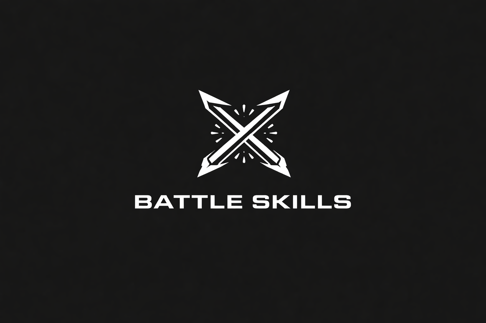

<div align="center">
  

# ⚔️ Battle Skills

_Personal collection of battle-tested agentic skills for Claude Code, Cursor, Gemini CLI, Codex CLI, and more._

[](https://opensource.org/licenses/MIT)
[](https://claude.ai)
[](https://github.com/google-gemini/gemini-cli)
[](https://github.com/openai/codex)
[](https://kiro.dev)
[](https://cursor.sh)
[](https://github.com/features/copilot)
[](https://github.com/opencode-ai/opencode)
[](https://github.com/sickn33/antigravity-awesome-skills)
[](                    buymeacoffee.com/tangaiquoc                )

</div>

These are **real skills from real projects** — not theoretical patterns. Each one has been used in production and refined through actual use.

---

## 📑 Table of Contents

- [🚀 Quick Start](#-quick-start)
- [🛠️ Installation](#️-installation)
- [📦 Features](#-features)
- [🎯 Available Skills](#-available-skills)
- [🤝 How to Contribute](#-how-to-contribute)
- [💬 Community & Support](#-community--support)
- [👥 Repo Contributors](#-repo-contributors)
- [⚖️ License](#️-license)
- [🌟 Star History](#-star-history)

---

## 🚀 Quick Start

1. Install via your AI assistant's directory (`.claude/skills`, `.cursor/skills`, etc.)
2. Use by naming the skill in the prompt (e.g. `Use awesome-readme to...`)
3. Validate and build new skills easily with our included scripts.

---

## 🛠️ Installation

**💡 Recommended: Use the CLI Installer**

```bash
# Install directly to your favorite AI Assistant
npx battle-skills --cursor       # For Cursor
npx battle-skills --claude       # For Claude Code
npx battle-skills --gemini       # For Gemini CLI
npx battle-skills --antigravity  # For Antigravity
npx battle-skills --path ./battle-skills   # Custom path (.agent/skills)
```

**Alternative: Manual Git Clone**

| Tool            | Install Command                                                          |
| --------------- | ------------------------------------------------------------------------ |
| **Claude Code** | `git clone https://github.com/QuocTang/battle-skills.git .claude/skills` |
| **Cursor**      | `git clone https://github.com/QuocTang/battle-skills.git .cursor/skills` |
| **Gemini CLI**  | `git clone https://github.com/QuocTang/battle-skills.git .gemini/skills` |
| **Universal**   | `git clone https://github.com/QuocTang/battle-skills.git .agent/skills`  |

**To update:** Rerun the `npx` command or `git -C <your_tool_folder>/skills pull`

---

## 📦 Features

- **✅ Battle-Tested:** Real, production-grade instructions built from hard-earned experience.
- **🔄 Universal Compatibility:** Works seamlessly with Claude, Cursor, Gemini CLI, and standard AI agent architectures.
- **🛠️ Self-Validating:** Includes `validate_skills.py` to ensure every skill is formatted perfectly.
- **📚 Auto-Documentation:** `gen_catalog.py` keeps the `CATALOG.md` and machine-readable `skills_index.json` constantly updated.

---

## 🎯 Available Skills

See the full list of our current capabilities in the 👉 **[CATALOG.md](CATALOG.md)**.

> Check out the `create-skill` guide if you want to understand how the battle skills are structured!

---

## 🤝 How to Contribute

We welcome contributions! Please follow these steps to add your own battle skills:

1. **Fork** the repository.
2. **Create a new branch** for your feature or skill.
3. Follow the `create-skill` guide to scaffold your new skill folder and `SKILL.md`.
4. Run `python3 scripts/validate_skills.py` and `python3 scripts/gen_catalog.py`.
5. Update `CHANGELOG.md` and **Submit a Pull Request**.

## 💬 Community & Support

If this repository saves you time or levels up your AI coding game, please give it a ⭐️!
Your support keeps the collection growing.

---

## 👥 Repo Contributors

<a href="https://github.com/QuocTang/battle-skills/graphs/contributors">
  
</a>

_Made with [contrib.rocks](https://contrib.rocks)._

---

## ⚖️ License

MIT License. See [LICENSE](LICENSE) for details.

---

## 🌟 Star History

[](https://star-history.com/#QuocTang/battle-skills&Date)
